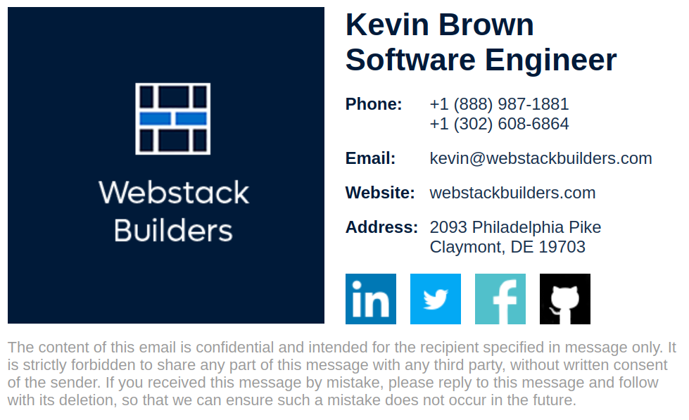

# Webstack Builders Corporate HTML Email Signature

This is a generator for creating two-column responsive, accessible, and minified HTML e-mail signatures from JSON data file. It will create one HTML file per user in the `dist` folder that can be uploaded through an e-mail client to your server.

**Example:**



If you'd like to use this generator, it's probably easiest to fork the repo and update the relevant files. It's not doing anything crazy with its dependencies so they will probably upgrade smoothly.

Note: the generated signatures are intended to be appended to text-only e-mails. If you're inserting them into HTML e-mails, you'll want to remove the `<html>`, `<head>` and `<body>` tags from the `src/_partials/layout.njk` template. You'll also need to move the styles that are generated from the `src/_partials/styles.njk` template into the `<head>` of your HTML e-mail document.

## Company Data

Update the `src/_data/companyData.json` file to your company contact information. Note the Nunjucks templates are set up to use main incoming toll-free and local telephone numbers. If you'd like to customize the templates to include extensions, you'll need to include a new field in `src/_data/userData.json` for each user and add the output in the `src/_partials/contact-info.njk` template.

## User Data

Update the `src/_data/userData.json` file with your user name, job title, and contact information. The file is an array of objects, one per user.

## Company Logo

The logo block is a 300 x 300 px block, probably with a company logo and name, embedded in the HTML signature from the Nunjucks template `src/_partials/images/logo.njk`. Note that using an image file will result in a significantly larger file and many e-mail service providers limit the total size of e-mails, often clipping at the end (and thus your signature). Gmail is an example provider that clips e-mails based on lengths. If you do use an image in your signature, you may want to load the image from a CDN or server.

The social media icons are in this folder also if you need to replace them or add other icons. If you add or remove social media contact icons, you'll need to update the `src/_partials/social-media-links.njk` template and add the revelant link fields to `src/_data/userData.json`.

To convert a png to an embedded image file, use the `base64` utility from a Linux command line or an online converter:

```bash
base64 -w 0 my-image.png
```

Then cut and paste the base64 encoded image data into the appropriate image tag in either the `src/pages/email-footer.njk` file for the logo or `src/_partials/images/*.njk` files social media icons.

```html

```

## Generate Minified HTML Signature

```bash
yarn build
```

## Run Development Server

```bash
yarn serve
```

## Lint Output

The build flow outputs signatures to the `.cache` folder, and then copies the minified output to the `dist` folder. The lint command works on the non-minified output.

```bash
yarn lint
```
